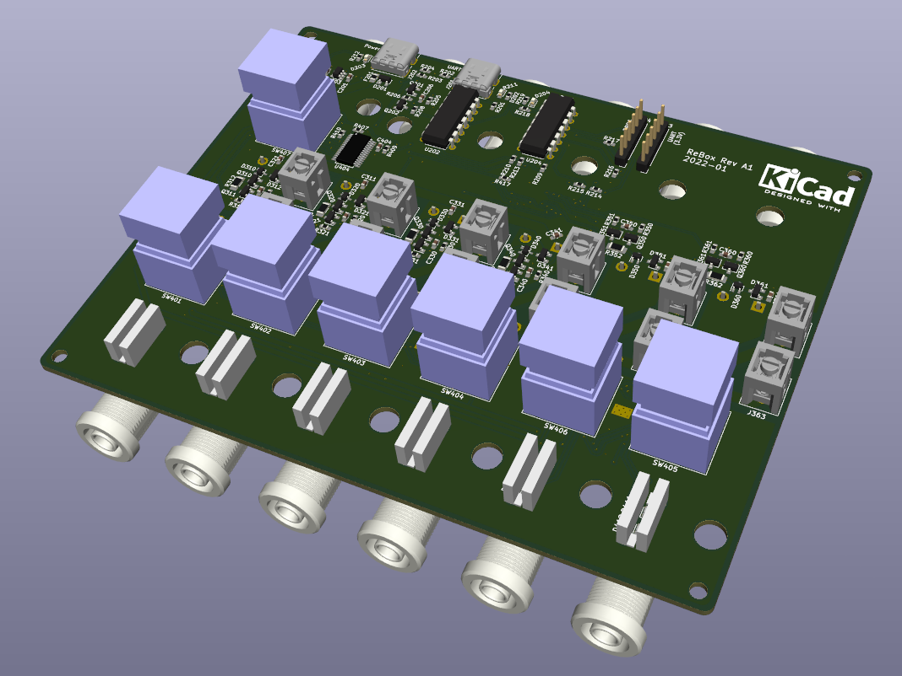
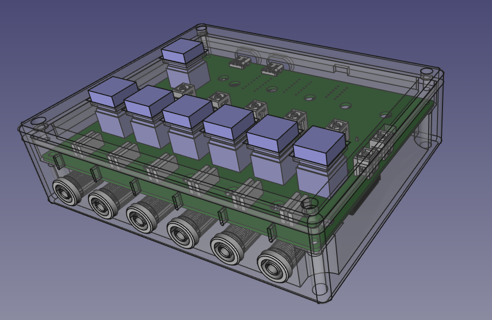
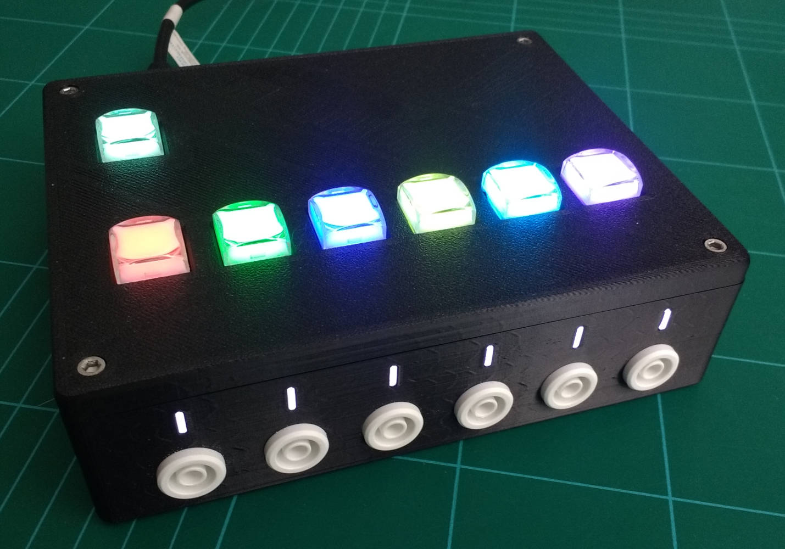
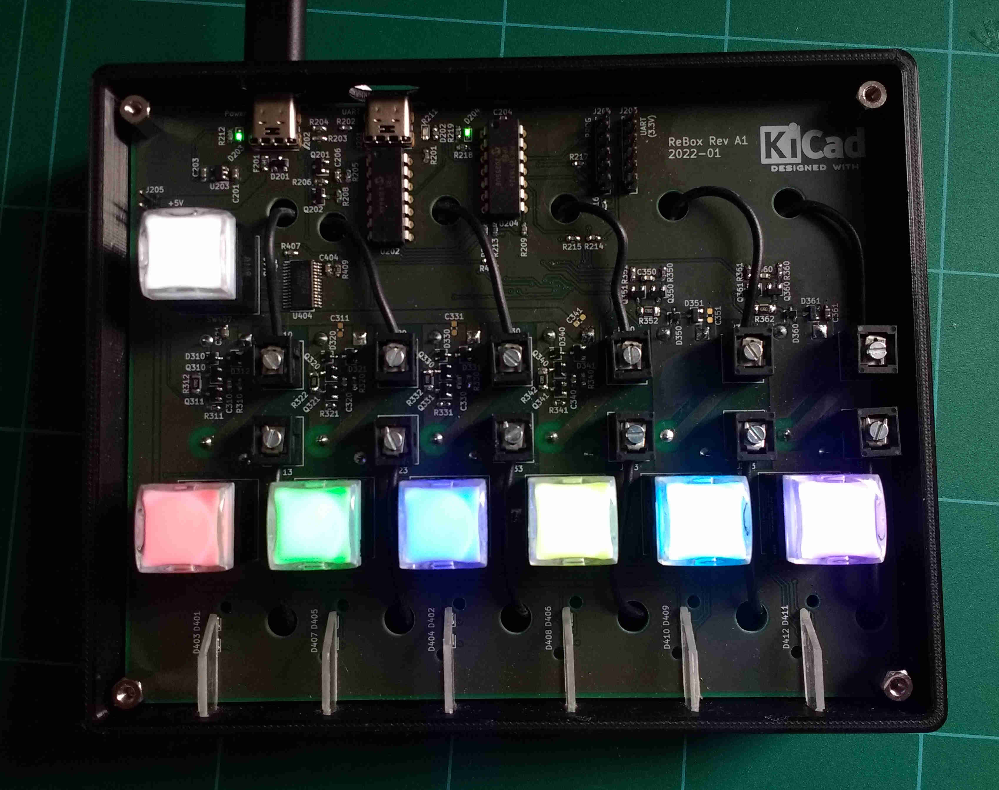
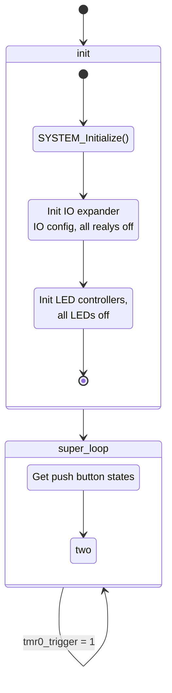

# ReBox - Programmable Relay Switch Box

I started this project to overcome a few nuisances at my working place. I use a couple of old bench power supplies that are still fine. But every one of those suckers features only a mains power switch. So if you hit this switch, the power supply makes a (surprisingly satisfying) 'brrroomp' sound and all output voltage rails go live. The resulting switching transients are neither particularly nice nor repeatable. Nothing you want to hook up to some electronic device.

Yeah, you can solve this by a simple cable switch, what I did. But then, what to do when you need to switch two supply voltages at the same time? You build another cable switch with a double pole single (DPST) throw switch. And if you've got three supply voltages? Well, this is were this projects starts.

My goals for this new device (unimaginatively called ReBox) to be developed were:

* Capability to switch up to six voltages
* Maximum switching current of 10 A at 30 V per channel
* Relays for switching
* 4 mm banana jacks for in- and outputs
* Programmable switch groups: switches in the same group will switch at the same time instance
* Power is supplied via USB-C connector (increasingly common, much more robust than Micro-USB)
* USB-serial interface for debugging and remote control
* Some fancy RGB-LED stuff

# Component Choices

## Push Buttons

After intensive searching I went for push buttons I found on AliExpress: [PB06-B-WT-2RGB-N-Y](http://www.honyone.com/en/products/list_32_1.html). They were in stock, cheap an looked quite nice. The downside: they lacked in the documentation department. Those are push buttons with RGB LEDs. Perfect for assigning each push button to a group / color.

## MCU

I was already familiar with the Microchip PIC MCUs. So I chose a PIC16. I have only a PICKit 3 Programmer that doesn't feature an integrated UART for debugging. So some kind of external UART is nescessary.

## USB UART

I went for a [MCP2221A](https://www.microchip.com/en-us/product/MCP2221A) as a USB to UART converter after I realized that none of usual FTDI chips were in stock. I also had to go with a big DIP package (same for the MCU).

